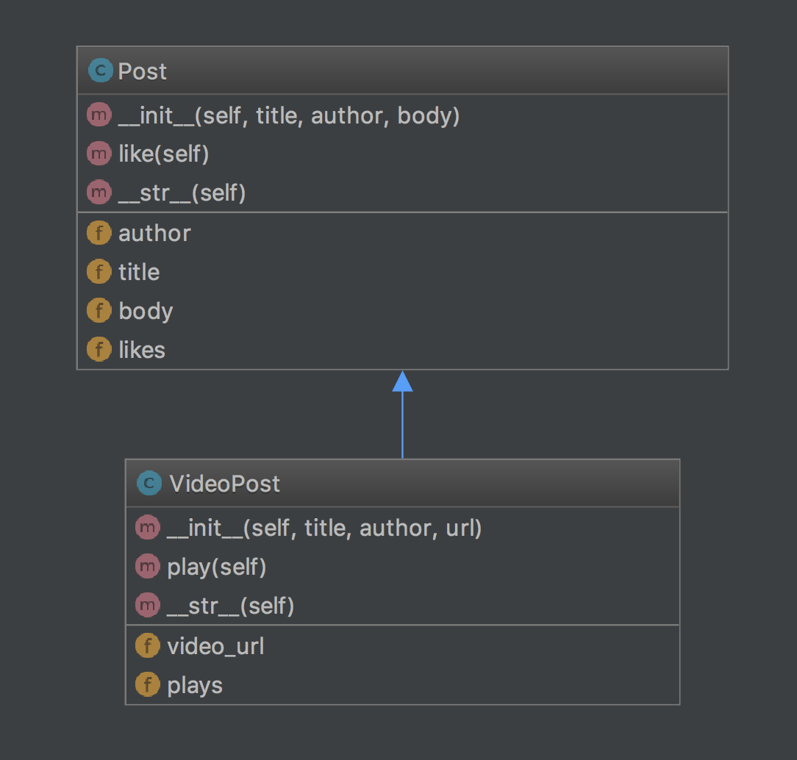
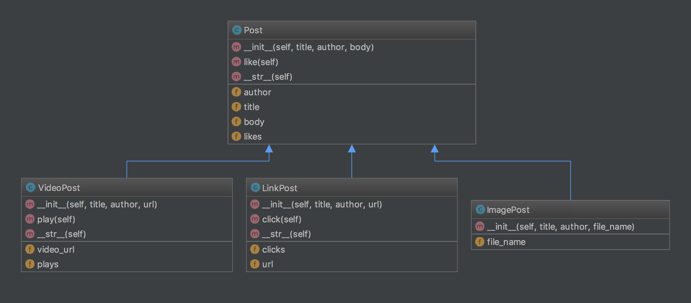

# Studio: Blog Design

## Concepts Used

- Class creation
- Inheritance
- Class diagrams

## Walkthrough

After introducing the concept of a class diagram, we create `Post` and `VideoPost` classes based on a given class diagram.

## Studio

Students create two additional extensions of `Post`: `LinkPost` and `ImagePost`

[Book Page Link](https://runestone.launchcode.org/runestone/static/thinkcspy/Studios/blog-design.html)
